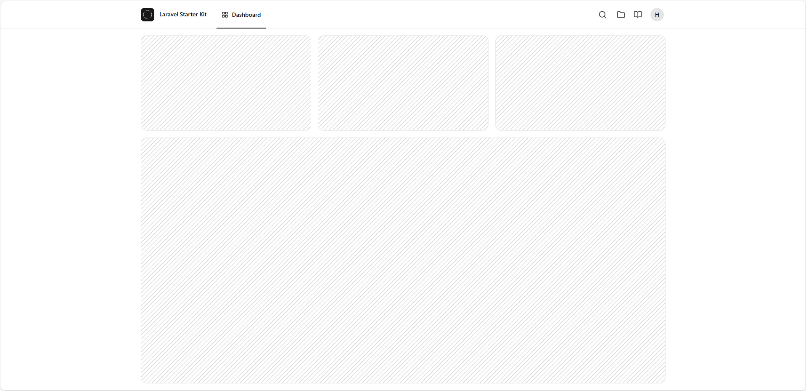
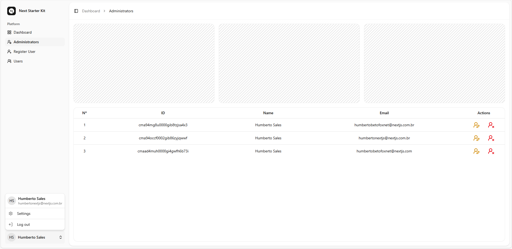
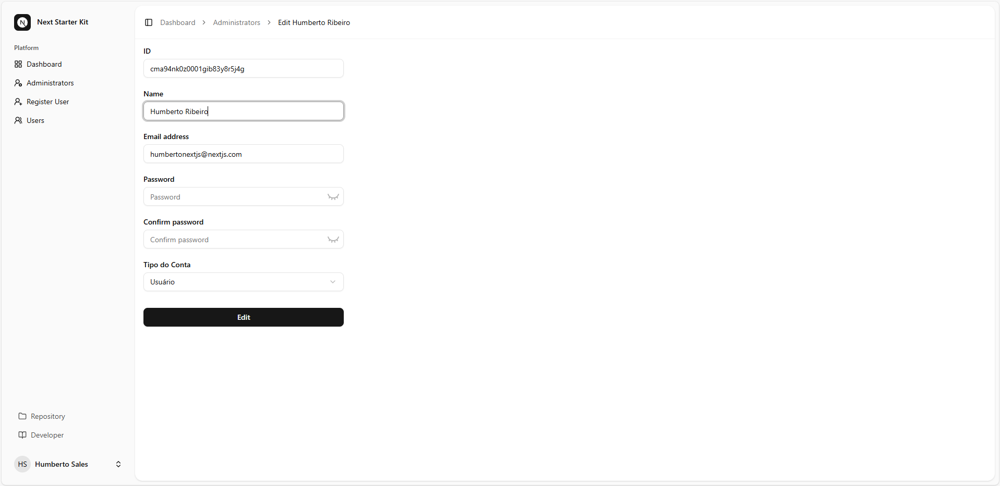

<div align="center">

  <a href="https://betofoxnet-info.vercel.app/"></a>

# BetoFoxNet

  <a href="https://nextjs.org/"></a>

## Sobre NextJS
### Autenticação!

---

## 📚 Traduções: [English](README.en.md)

</div>

## 👤 Página de Registro de Administrador (Next.js + Prisma)
Este projeto inclui uma página de registro de administrador protegida. O formulário é acessível se não houver um usuário administrador no banco de dados o primeiro Usuário criado é com o `role` `"ADMIN"` e os próximos seram `"USER"`.
Ele foi criado com Next.js App Router, Prisma, bcrypt-ts, React Hooks, shadcn-ui e validação Zod.

## 📁 Estrutura de Arquivos

```bash

/app
  /register
    └── page.tsx                # Redireciona se o administrador existir
    └── form-register-admin.tsx # Formulário de registro de administrador do lado do cliente

/app/api/actions
  └── createadmin.ts           # Lógica do lado do servidor para criação de administrador

/lib
  └── prisma.ts                # Cliente Prisma
  └── session.ts               # Gerenciamento de sessão
  └── definitions.ts           # Definições do esquema Zod

```

---

## 🚦 Lógica de redirecionamento (`page.tsx`)

```tsx

const isUserAdmin = await prisma.user.findMany({ where: { role: 'ADMIN' } });
if (isUserAdmin.length > 0) redirect('/dashboard');

```
Se já existir um usuário ADMIN, ele será redirecionado para `/dashboard`.
Caso contrário, o formulário de registro de administrador será exibido.

---

## 🧾 Formulário de Registro de Administrador

### O formulário inclui os seguintes campos:

- Nome

- E-mail

- Senha

- Confirmação de senha

- Função (bloqueada para ADMIN)

### A validação inclui:

- Campos obrigatórios

- Formato de e-mail válido

- Correspondência de senha

- Senha forte (gerenciada pelo Zod)

### Recursos de UX:

- Alternar entre mostrar/ocultar senha

- Mensagens de erro em linha

- Spinner de carregamento no botão de envio

---

## 🔐 createAdmin – Lógica de criação de conta de `administrador/usuário`

```ts

'use server';

import { createAdminSchema, FormStateCreateAdmin } from '@/lib/definitions';
import prisma from '@/lib/prisma';
import { createSession } from '@/lib/session';
import * as bcrypt from 'bcrypt-ts';

export async function createAdmin(state: FormStateCreateAdmin, formData: FormData): Promise<FormStateCreateAdmin> {
    const validatedFields = createAdminSchema.safeParse({
        name: formData.get('name') as string,
        email: (formData.get('email') as string)?.toLowerCase().trim(),
        password: formData.get('password') as string,
        password_confirmation: formData.get('password_confirmation') as string
    });

    if (!validatedFields.success) return { errors: validatedFields.error.flatten().fieldErrors };

    const { name, email, password } = validatedFields.data;

    try {
        const existingUser = await prisma.user.findFirst({ where: { email } });

        if (existingUser) return { warning: 'WarningUserExisting' };

        const existingUserAdmin = await prisma.user.findFirst({ where: { role: 'ADMIN' } });

        const role = existingUserAdmin ? 'USER' : 'ADMIN';

        const hashedPassword = await bcrypt.hash(password, 12);

        const user = await prisma.user.create({ data: { name, email, role, password: hashedPassword } });

        await createSession(user.id, user.role);

        return { message: true };
    } catch (error) {
        console.error(error);
        return { warning: 'Warning' };
    }
}

```

## 📌 Objetivo

Esta ação do servidor é responsável por registrar um novo usuário, atribuir a função correta (ADMIN ou USUÁRIO), gerar um hash seguro da senha e criar automaticamente uma sessão após o registro bem-sucedido.

## 🧠 Explicação passo a passo

## ✅ 1. Validação de formulário com Zod

```ts

const validatedFields = createAdminSchema.safeParse({ ... });

```

- Valida:

  - nome (string)

  - e-mail (deve ser válido)

  - senha

  - confirmação_da_senha (deve corresponder à senha)

- Toda a validação é feita no servidor usando Zod.

- Retorna mensagens de erro em linha se inválido.

## 🧾 2. Impedir contas duplicadas

```ts

const existingUser = await prisma.user.findFirst({ where: { email } });

if (existingUser) return { warning: 'WarningUserExisting' };

```

- Se o e-mail já estiver em uso, o cadastro será bloqueado.

- Retorna um aviso para ser exibido no frontend.

## 🧑‍💼 3. Atribuição dinâmica de funções

```ts

const existingUserAdmin = await prisma.user.findFirst({ where: { role: 'ADMIN' } });

const role = existingUserAdmin ? 'USER' : 'ADMIN';

```

- Utiliza bcrypt-ts para hashing de senha seguro e assíncrono.

- Aplica 12 rodadas de salt para proteção robusta.

## 🗃️ 5. Armazene o usuário no banco de dados

```ts

const user = await prisma.user.create({ data: { ... } });

```

- Salva o usuário na tabela Usuário usando o Prisma.

- Campos:

- nome, e-mail, função e senha com hash.

## 🔓 6. Login automático após o registro

```ts

await createSession(user.id, user.role);

```

- Cria uma sessão para o usuário imediatamente após o cadastro.

- Utiliza cookies seguros somente HTTP (definidos em createSession) com JWT.

## ⚠️ 7. Tratamento de Erros

```ts

return { warning: 'Warning' };

```

## 🛡️ Segurança e Melhores Práticas

| Recurso                         | Descrição
|---------------------------------|--------------------------------------------------------------------|
| ✅ Validação de esquema         | Todos os campos validados com Zod antes de qualquer ação do BD     |
| 🔒 Hash de senha                | bcrypt-ts usado com 12 rodadas de saltos                           |
| 🔐 Sessão JWT                   | A sessão é armazenada em um cookie seguro, httpOnly, usando JWT    |
| 🚫 Regra de administração única | Somente o primeiro usuário pode se registrar como ADMIN            |
| 📬 Exclusividade do e-mail      | Garante que não haja contas de e-mail duplicadas                   |
| ✅ Login automático             | Efetua login do usuário imediatamente após o registro bem-sucedido |

## 🧪 Resultados esperados

| Cenário 	                         | Resultado
|------------------------------------|----------------------------------------------|
| Registro válido (primeiro usuário) | Cria ADMIN → efetua login → redireciona      |
| Registro válido (outros)           | Cria USUÁRIO → efetua login → redireciona    |
| O e-mail já existe                 | Retorna o aviso "WarningUserExisting"        |
| Falha na validação                 | Erros de campo em linha mostrados ao usuário |
| Erro inesperado                    | Retorna o aviso "Warning" (falha genérica)   |

## ✅ Summary

Esta função é uma maneira segura e fácil de usar para gerenciar:

- Registro único de conta de ADMINISTRADOR

- Criação de usuário com validação e lógica de função

- Hash de senha e criação de sessão

- Tratamento de erros e prevenção de duplicatas

Avise-me se você deseja isso em um arquivo Markdown, adicionado aos seus documentos ou precisa de suporte para recursos multiadministradores, limitação de taxa ou verificação de e-mail.

---

## 🔐 Lógica do lado do servidor (createadmin.ts)

```ts

const hashedPassword = await bcrypt.hash(password, 12);
const user = await prisma.user.create({ data: { name, email, role, password: hashedPassword } });

```

### A função createAdmin:

1. Valida os dados do formulário usando Zod.

2. Faz o hash da senha com bcrypt-ts.

3. Cria o usuário no banco de dados usando Prisma.

4. Inicia uma sessão automaticamente.

Em caso de falha, retorna um aviso genérico que é exibido na interface do usuário.

---

## 📋 Como usar

1. Clone este repositório.

2. Configure suas variáveis ​​de ambiente, especialmente DATABASE_URL.

3. Execute as migrações Prisma:

```bash

npx prisma migrate dev

```

4. Inicie o servidor de desenvolvimento:

```bash

npm run dev

```

5. Acesse `http://localhost:3000`.

Se não houver um administrador, o formulário será exibido. Caso contrário, você será redirecionado.

---

## ✅ Pilha de Tecnologia

- Next.js (Roteador de Aplicativos)

- Prisma ORM

- Zod (validação de formulários)

- bcrypt-ts (hash de senhas)

- React Hooks

- next-intl (internacionalização)

- lucide-react (ícones)

---

## 💡 Observações

- O registro é único: permitido somente se não houver um administrador.

- O campo de função é definido como ADMIN para evitar tipos de usuário arbitrários.

- Todos os textos são localizados usando next-intl para suporte a vários idiomas.

---

## 🧩 Visão geral

Este módulo de login inclui:

- Um componente de servidor (LoginPage) que envolve o formulário de login em um limite Suspense.

- Um componente de cliente (LoginClient) que renderiza o formulário.

- Uma ação de servidor (loginUser) que lida com a autenticação do usuário com segurança no lado do servidor.

---

### 📁 Estrutura do arquivo

```pgsql

/login
 ├── page.tsx                <- Server Component (LoginPage)
 ├── login-client.tsx        <- Client Component (Login)
/api/actions/loginuser.ts    <- Server Action for login

```

---

1. 🧠 LoginPage – Componente do Servidor

```tsx

import { Suspense } from 'react';
import LoginClient from './login-client';
import LoadingLoginSimple from '@/components/loadings/loading-login-simple';

export const metadata = { title: 'Log in' };

export default function LoginPage() {
    return (
        <Suspense fallback={<LoadingLoginSimple />}>
            <LoginClient />
        </Suspense>
    );
}

```

---

# 2. 🧾 LoginClient – ​​Formulário de Login (Componente Cliente)

### Recursos:

- Entradas controladas com useState.

- Mensagens de erro de validação via state.errors.

- Alternância de visibilidade da senha.

- Carregamento de feedback durante o envio.

- Internacionalização via next-intl.

- Redirecionamento para /dashboard em caso de sucesso.

### Ganchos utilizados:

- useActionState() → Executa loginUser.

- useEffect() → Manipula parâmetros de consulta de URL (como ?status=...).

- useRef() → Para definir o foco da entrada.

- useRouter() → Para redirecionar programaticamente.

### Fluxo:

- O usuário preenche o formulário → o envia.

- Chama a ação do servidor loginUser via useActionState.

- Manipula erros de validação, mensagens e redirecionamentos com base no resultado.

---

# 3. 🔐 loginUser – Ação do Servidor

```ts

'use server';

import prisma from '@/lib/prisma';
import { compare } from 'bcrypt-ts';
import { createSession } from '@/lib/session';

export async function loginUser(state, formData) {
    const validatedFields = signInSchema.safeParse({
        email: formData.get('email'),
        password: formData.get('password'),
    });

    if (!validatedFields.success)
        return { errors: validatedFields.error.flatten().fieldErrors };

    const { email, password } = validatedFields.data;

    try {
        const user = await prisma.user.findFirst({ where: { email, deletedAt: null } });
        if (!user || !(await compare(password, user.password)))
            return { warning: 'WarningOne' };

        await createSession(user.id);
        return { message: 'Message' };
    } catch (error) {
        console.error(error);
        return { warning: 'WarningTwo' };
    }
}

```

### Lógica-chave:

- Valida e-mail e senha usando o esquema Zod.

- Encontra o usuário no banco de dados Prisma.

- Compara senhas com hash usando bcrypt-ts.

- Se bem-sucedido, cria uma sessão.

- Retorna erros de validação, avisos ou uma mensagem de sucesso.

---

# 4. 🌍 Traduções com `next-intl`

O formulário usa useTranslations('Login') para localização. Exemplo:

```tsx

const t = useTranslations('Login');

<Label htmlFor="email">{t('EmailLabel')}</Label>

```

Você precisará de arquivos de tradução como:

```json

// messages/en.json
{
  "Login": {
    "Title": "Log In",
    "Description": "Welcome back! Please sign in.",
    "EmailLabel": "Email",
    "EmailPlaceholder": "Enter your email",
    "PasswordLabel": "Password",
    "PasswordPlaceholder": "Enter your password",
    "Forgot": "Forgot password?",
    "Submit": "Sign In",
    "Message": "Login successful!",
    "WarningOne": "Invalid credentials.",
    "WarningTwo": "Unexpected error. Please try again."
  }
}

```

---

# ⚙️ Configurando next-intl em next.config.js

Para habilitar o suporte a vários idiomas no Next.js com next-intl, você precisa usar o plugin na sua configuração do Next.js:

```ts

// next.config.js ou next.config.ts
import type { NextConfig } from 'next';
import createNextIntlPlugin from 'next-intl/plugin';

const nextConfig: NextConfig = {};
const withNextIntl = createNextIntlPlugin();

export default withNextIntl(nextConfig);

```

---

# 🧩 Usando NextIntlClientProvider no layout raiz

No seu layout raiz, use NextIntlClientProvider para injetar as mensagens de localidade e tradução atuais no seu aplicativo. Veja como ele se encaixa no seu componente RootLayout:

```tsx

// app/layout.tsx
import type { Metadata } from 'next';
import { Geist, Geist_Mono } from 'next/font/google';
import './globals.css';
import { ThemeProvider } from '@/components/theme-provider';
import { BreadcrumbProvider } from '@/context/breadcrumb-context';
import { NextIntlClientProvider } from 'next-intl';
import { getLocale, getMessages } from 'next-intl/server';

const geistSans = Geist({ variable: '--font-geist-sans', subsets: ['latin'] });
const geistMono = Geist_Mono({ variable: '--font-geist-mono', subsets: ['latin'] });

export const metadata: Metadata = {
  title: 'Create Next App',
  description: 'Generated by create next app',
};

export default async function RootLayout({
  children,
}: Readonly<{
  children: React.ReactNode;
}>) {
  const locale = await getLocale();
  const messages = await getMessages();

  return (
    <html lang={locale} suppressHydrationWarning>
      <body className={`${geistSans.variable} ${geistMono.variable} antialiased`}>
        <ThemeProvider attribute="class" defaultTheme="system" enableSystem disableTransitionOnChange>
          <NextIntlClientProvider locale={locale} messages={messages}>
            <BreadcrumbProvider>{children}</BreadcrumbProvider>
          </NextIntlClientProvider>
        </ThemeProvider>
      </body>
    </html>
  );
}

```

---

# ✅ Requisitos

Para que tudo funcione, certifique-se de ter:

- ✅ zod para validação (signInSchema).

- ✅ bcrypt-ts para hash/comparação de senhas.

- ✅ prisma e um modelo User com os campos: email, password, deletedAt.

- ✅ Manipulação de sessão com createSession(user.id).

- ✅ Configuração de tradução com next-intl.

---

# 🧪 Como Testar

1. Falha no Login: Tente com credenciais inválidas → Você deverá ver um erro.

2. E-mail pré-preenchido: Acesse uma URL como ?email=test@example.com&status=created → O formulário é pré-preenchido e uma mensagem é exibida.

3. Alternar Senha: Clique no ícone de olho para alternar a visibilidade da senha.

4. Esqueceu a Senha: O link aparece somente quando o status não está definido.

5. Sucesso: Em caso de login correto, redireciona para `/dashboard`.
---

# 🛡️ Tutorial: Autenticação JWT com Cookies Somente HTTP no Next.js (App Router)

Este sistema de autenticação utiliza:

- jose para assinatura e verificação JWT

- Cookies Somente HTTP para armazenamento seguro de sessões

- Middleware Next.js para proteção de rotas

- Prisma ORM para buscar dados de usuários autenticados

---

# 🧱 Visão Geral da Estrutura do Projeto

O sistema é dividido em três módulos principais:

1. session.ts – Gerenciamento de sessão: cria, verifica, atualiza e descriptografa JWTs

2. getUser.ts – Recupera o usuário autenticado atual do banco de dados

3. middleware.ts – Protege rotas com base no estado da sessão

---

# 📦 1. session.ts – Gerenciamento de Sessão com JWT

⚙️ Configuração Inicial

```ts

import 'server-only';
import { SignJWT, jwtVerify } from 'jose';
import { cookies } from 'next/headers';
import { redirect } from 'next/navigation';

if (!process.env.AUTH_SECRET) throw new Error('SECRET is not defined');
const secretKey = process.env.AUTH_SECRET;
const encodedKey = new TextEncoder().encode(secretKey);

```

- Carrega uma chave secreta do ambiente (`AUTH_SECRET`)

- Esta chave é usada para assinar e verificar JWTs usando o algoritmo `HS256`

---

# 🔒 Configurações de vida útil do token

```ts

const MAX_SESSION_AGE = 24 * 60 * 60;   // 24 horas
const TOKEN_LIFETIME = 15 * 60;        // 15 minutos
const RENEW_THRESHOLD = 5 * 60;        // 5 minutos

```

- TOKEN_LIFETIME: Tempo de vida inicial do JWT

- RENEW_THRESHOLD: Se o tempo restante do JWT for menor que esse, ele será atualizado.

- MAX_SESSION_AGE: Tempo máximo absoluto da sessão (após o qual o usuário deve se autenticar novamente).

---

# 🔐 createSession(userId: string)

Gera um JWT assinado (`válido por 15 minutos`) e o define em um cookie seguro, `somente HTTP`, chamado `sessionAuth`.

```ts

export async function createSession(userId: string): Promise<void> {
    const now = Math.floor(Date.now() / 1000);
    const expTimestamp = now + TOKEN_LIFETIME;
    const expDate = new Date(expTimestamp * 1000);

    const session = await new SignJWT({ userId, role, iat: now })
        .setProtectedHeader({ alg: 'HS256' })
        .setIssuedAt(now)
        .setExpirationTime(expTimestamp)
        .sign(encodedKey);

    (await cookies()).set('sessionAuth', session, {
        httpOnly: true,
        secure: true,
        expires: expDate,
        sameSite: 'lax',
        path: '/'
    });
}

```

## Atributos do cookie:

- `httpOnly`: não acessível via JavaScript (protege contra XSS)

- `secure`: enviado somente via HTTPS

- `sameSite: 'lax'`: atenua CSRF

- `expires`: 15 minutos após a emissão

- `path: '/'`: válido em todo o site

---

# 🔎 decrypt(session: string)

Decodifica e verifica o JWT. Retorna o payload ou `null` se o token for inválido ou expirado.

```ts

export async function decrypt(session: string | undefined = '') {
    if (!session) return null;
    try {
        const { payload } = await jwtVerify(session, encodedKey, { algorithms: ['HS256'] });
        return payload;
    } catch (err) {
        console.log('failed to verify session', err);
        return null;
    }
}

```

- Verifica usando HS256 com o segredo compartilhado

- Trata tokens inválidos ou ausentes com elegância

---

# ✅ verifySession()

Verifica se existe uma sessão válida. Caso contrário, redireciona o usuário para `/login`.

```ts

export async function verifySession(): Promise<{ isAuth: boolean; userId: string; }> {
    const cookie = (await cookies()).get('sessionAuth')?.value;
    const session = await decrypt(cookie);
    if (!session?.userId) redirect('/login');

    return { isAuth: true, userId: String(session.userId) };
}

```

- Retorna `{ isAuth: true, userId }` se autenticado

- Caso contrário, chama `redirect('/login')`

---

# 🧾 getSession()

Retorna o payload da sessão, se presente e válido, sem acionar um redirecionamento.

```ts

export async function getSession() {
    const session = (await cookies()).get('sessionAuth')?.value;
    if (!session) return null;
    return await decrypt(session);
}

```

- Útil para autenticação opcional ou verificações de antecedentes

---

# 🔄 updateSession()

Renova o cookie de sessão se estiver prestes a expirar e dentro do tempo máximo permitido para a sessão.

```ts

export async function updateSession() {
    const sessionToken = (await cookies()).get('sessionAuth')?.value;

    if (!sessionToken) return null;

    const payload = await decrypt(sessionToken);

    if (!payload?.userId || !payload.exp || !payload.iat) return null;

    const now = Math.floor(Date.now() / 1000);
    const timeLeft = payload.exp - now;
    const sessionAge = now - payload.iat;

    if (sessionAge > MAX_SESSION_AGE) {
        (await cookies()).delete('sessionAuth');
        return null;
    }

    if (timeLeft < RENEW_THRESHOLD) {
        const newExp = now + TOKEN_LIFETIME;
        const newExpDate = new Date(newExp * 1000);

        const newToken = await new SignJWT({ userId: payload.userId, role: payload.role, iat: payload.iat })
            .setProtectedHeader({ alg: 'HS256' })
            .setIssuedAt(payload.iat)
            .setExpirationTime(newExp)
            .sign(encodedKey);

        (await cookies()).set('sessionAuth', newToken, {
            httpOnly: true,
            secure: true,
            expires: newExpDate,
            sameSite: 'lax',
            path: '/'
        });
    }
    return { userId: payload.userId, role: payload.role };
}

```

## Lógica de Renovação:

Verifica quanto tempo resta no token atual (`timeLeft`)

Se `timeLeft < RENEW_THRESHOLD`, cria um novo token sem alterar o `iat` original

Garante que as sessões não possam ser estendidas indefinidamente atualizando dentro de `MAX_SESSION_AGE`

Se `MAX_SESSION_AGE` for excedido, a sessão será excluída e o usuário será desconectado

```ts

{ userId: string, role: string } | null

```

---

# 👤 2. getUser.ts – Obter usuário autenticado

```ts

import 'server-only';
import { cache } from 'react';
import prisma from './prisma';
import { verifySession } from './session';

```

---

# 📥 getUser()

Obtém o usuário no banco de dados usando o ID da sessão.

```ts

export const getUser = cache(async () => {
  const session = await verifySession();
  ...
});

```

- Utiliza Prisma para obter detalhes do usuário

- Encapsulado em cache() para eficiência dos componentes do servidor

---

# 🛡️ 3. middleware.ts – Proteção de Rota com JWT e Acesso Baseado em Função

Este middleware protege rotas com base na presença da sessão e na função do usuário.

## 📄 Código do Middleware (Versão Mais Recente)

```ts

import { NextRequest, NextResponse } from 'next/server';
import { updateSession } from './lib/session';

export default async function middleware(req: NextRequest) {
  const path = req.nextUrl.pathname;

  const isProtectedRoute = path.startsWith('/dashboard');
  const isAdminRoute = path.startsWith('/dashboard/admins');
  const isPublicRoute = ['/login', '/'].includes(path);

  const session = await updateSession();

  if (isProtectedRoute && !session?.userId) {
    return NextResponse.redirect(new URL(`/login?redirect=${encodeURIComponent(path)}`, req.nextUrl));
  }

  if (isPublicRoute && session?.userId && !path.startsWith('/dashboard')) {
    return NextResponse.redirect(new URL('/dashboard', req.nextUrl));
  }

  if (isAdminRoute && session?.role !== 'ADMIN') {
    return NextResponse.redirect(new URL('/dashboard', req.nextUrl));
  }

  return NextResponse.next();
}

export const config = {
  matcher: ['/((?!api|_next/static|_next/image|favicon.ico|sitemap.xml|robots.txt|videos/).*)']
};


```

---

## 🔍 Visão geral do comportamento da rota

| Rota                  | Tipo                          | Condição Comportamental                                                 |
|-----------------------|-------------------------------|-------------------------------------------------------------------------|
| Pública	              | `/login`, `/`, `/register`    | Redireciona para `/dashboard` se a sessão existir                       |
| Protegida	            | Sub Rotas `/dashboard`	      | Requer sessão válida (`userId`) ou redireciona para login               |
| Somente administrador	| Sub Rotas `/dashboard/admins` | Requer função = `'ADMIN'`, caso contrário redireciona para `/dashboard` |

---

# ⚙️ Middleware Matcher
Esta configuração garante que o middleware seja executado apenas em rotas relevantes, ignorando ativos estáticos e endpoints de API:

```ts

export const config = {
  matcher: [
    '/((?!api|_next/static|_next/image|favicon.ico|sitemap.xml|robots.txt|videos/).*)',
  ],
};

```

- <strong>Exclui</strong>: Rotas de API, ativos estáticos Next.js, mídia e arquivos de SEO

- <strong>Aplica-se a</strong>: Todas as outras páginas (incluindo as dinâmicas)

---

# ✅ Como usar em seu aplicativo

### 1. Variável de ambiente

No seu arquivo .env:

 ```ini

 AUTH_SECRET=your_super_secure_secret_key

```

Use um segredo forte e aleatório

---

### 2. Exemplo de Login

Quando um usuário efetua login com sucesso:

```ts

await createSession(user.id);
redirect('/dashboard');

```

---

### 3. Exemplo de Logout

Para encerrar a sessão:

```ts

(await cookies()).set('sessionAuth', '', { expires: new Date(0) });
redirect('/login');

```

---

### 4. Use getUser() em componentes do servidor

```ts

import { getUser } from '@/lib/getUser';

export default async function DashboardPage() {
  const user = await getUser();

  return <div>Welcome, {user?.name}</div>;
}

```

---

# 🔐 Notas de Segurança

- O JWT é armazenado em um cookie httpOnly seguro → não acessível ao JS

- Os tokens têm vida curta (15 minutos) e são renovados automaticamente

- A renovação da sessão é tratada de forma transparente no middleware

- Todas as rotas protegidas são verificadas a cada solicitação no lado do servidor

---

# 📌 Resumo

Esta configuração oferece:

- Autenticação segura baseada em sessão com JWT

- Proteção de rota usando middleware

- Gerenciamento de usuários baseado em Prisma

- Renovação automática de sessão

---

## 📧 Sistema de Verificação de E-mail e Redefinição de Senha (Next.js + Prisma + Zod + Nodemailer)

Este projeto inclui um sistema de <strong>verificação de e-mail</strong> e <strong>redefinição de senha</strong> totalmente funcional, desenvolvido com <strong>Next.js App Router</strong>, <strong>Prisma</strong>, <strong>Zod</strong>, <strong>Nodemailer</strong> e <strong>crypto</strong>.

# 🔒 Recursos

## ✅ Verificação de e-mail no cadastro

- Após o cadastro, um link de verificação é enviado para o e-mail do usuário.

- O link é válido por 24 horas.

- Se o token expirar, um novo e-mail será enviado automaticamente.

## 🔁 Reenviar verificação de e-mail

- Usuários não verificados podem solicitar um novo e-mail de verificação.

- Um novo token é gerado e enviado, válido por 7 dias.

## 🔐 Redefinição de Senha

- Os usuários podem solicitar a redefinição de senha inserindo seu e-mail.

- Um link seguro de redefinição é enviado, válido por 1 hora.

- Após a atualização da senha, o token é invalidado.

# 🧠 Core Logic

## 🔍 Verificação Automática de E-mail

```ts

const email = sessionUser.email;
const tokenExisting = await prisma.verificationToken.findFirst({ where: { identifier: email } });

if (!isCheckedEmail?.emailVerified) {
  if (!tokenExisting || new Date() > tokenExisting.expires) {
    // Gerar novo token e enviar e-mail de verificação
  }
}

```

## 🔁 Reenviar verificação de e-mail

```ts

if (tokenExisting && new Date() > tokenExisting.expires) {
// Excluir token antigo
// Gerar e enviar um novo
}

```

## 📩 Envio de e-mails (Nodemailer + next-intl)

```ts

  await transporter.sendMail({
      from: `'next-kits-starter' <${process.env.SMTP_USER}>`,
      to,
      subject: `${t('SubjectEmail')}`,
      html: `
      <h2>${t('TextH2EmailOne')}</h2>
      <p>${t('ParagrafEmailOne')}</p>
      <a href='${link}'>${link}</a>
      <p>${t('ParagrafEmailTwo')}</p>
      `,
  });

```

## 🔁 Esqueceu a lógica da senha

```ts

const token = crypto.randomBytes(32).toString('hex');
const expires = new Date(Date.now() + 60 * 60 * 1000); // 1 hour

await prisma.verificationToken.create({ data: { identifier: email, token, expires } });

const resetLink = `${process.env.NEXT_URL}/auth/reset-password?token=${token}&email=${email}`;
await sendPasswordResetEmail(email, resetLink);

```

## 🔐 Redefinição de senha com token

```ts

const tokenExisting = await prisma.verificationToken.findUnique({
  where: { identifier_token: { identifier: email, token } }
});

if (!tokenExisting || tokenExisting.expires < new Date()) {
  return { warning: 'Warning' };
}

const hashedPassword = await hash(password, 12);

await prisma.user.update({ where: { email }, data: { password: hashedPassword } });

await prisma.verificationToken.delete({ where: { identifier_token: { identifier: email, token } } });

```

## 💾 Estrutura de pastas relacionadas

```bash

/app
  /auth
    └── verify-email.tsx         # Página de verificação de e-mail
    └── reset-password.tsx       # Página de redefinição de senha

/app/api/actions
  └── emailVerifiedChecked.ts    # Verifique se o e-mail foi verificado
  └── forgotPassword.ts          # Enviar link de redefinição
  └── resetPassword.ts           # Atualizar lógica de senha
  └── handleEmailVerification.ts # Verifique e confirme o e-mail

/lib
  └── mail.ts                    # Configuração e transporte de e-mail
  └── definitions.ts             # Validação do esquema Zod

```

## 🌍 Tradução de e-mails (via next-intl)

Suporta mensagens localizadas usando a biblioteca `next-intl`. Exemplo:

```json

"VerifyEmail": {
  "SubjectEmail": "Check your email",
  "TextH2EmailOne": "Email Confirmation",
  "ParagrafEmailOne": "Please click the link below to confirm your email:",
  "ParagrafEmailTwo": "If you did not request this, you can ignore this email."
}

```

## ⚙️ Variáveis ​​de Ambiente Necessárias

Adicione o seguinte ao seu arquivo `.env`:

```env

NEXT_URL=http://localhost:3000
SMTP_HOST=smtp.example.com
SMTP_PORT=587
SMTP_USER=your_email@example.com
SMTP_PASS=your_password

```

---

#### Exemplos de troca:

- Para usar o layout do cartão:

```tsx

import AuthLayoutTemplate from '@/components/layouts/auth/auth-card-layout';

```

<div align="center">

  

</div>

---

- Para usar o layout simples:

```tsx

import AuthLayoutTemplate from '@/components/layouts/auth/auth-simple-layout';

```

<div align="center">

  

</div>

---

- Para usar o layout dividido:

```tsx

import AuthLayoutTemplate from '@/components/layouts/auth/auth-split-layout';

```

<div align="center">

  

</div>

---

### ✅ Nada mais precisa ser alterado!

- O componente continuará funcionando normalmente. A alteração afeta apenas a aparência da página de autenticação.

---

### 🔐 Requisitos

- Cada um dos modelos requer:

Aplicar o layout com `children`, `title` e `description`, passando as propriedades corretas para o layout selecionado.

---

### 🧭 Modelos de Layout de Aplicativo

> **Page:** `/components/layouts/app-layout.tsx`

---

#### Recursos:
- Alteração de modelos para o layout principal do aplicativo (`AppLayout`).
- Suporte à autenticação com `next-auth`: o layout só é renderizado se houver uma sessão ativa.
- Os modelos recebem `user` e `breadcrumbs` como propriedades.
- Os componentes filhos (`children`) são renderizados dentro do layout selecionado.

---

### 📁 Modelos disponíveis

| Modelo                | Descrição                                                                           |
|-----------------------|-------------------------------------------------------------------------------------|
| `app-sidebar-layout`  | Layout com barra lateral de navegação — ideal para painéis e aplicativos complexos. |
| `app-header-layout`   | Layout de cabeçalho fixo na parte superior — mais compacto e direto.                |

---

### 🔁 Como alternar entre modelos

Para alterar o modelo de layout principal do aplicativo, **basta substituir a importação de layout** no arquivo `app-layout.tsx`.

---

#### Exemplos de troca:

- Para usar o layout da barra lateral:

```tsx

import AppLayoutTemplate from '@/components/layouts/app/app-sidebar-layout';

```

<div align="center">

  

</div>

---

- Para usar o layout do cabeçalho:

```tsx

import AppLayoutTemplate from '@/components/layouts/app/app-header-layout';

```

<div align="center">

  

</div>

---

### ✅ Nada mais precisa ser alterado

A estrutura permanece a mesma. O componente `AppLayout` renderiza o layout escolhido com base na importação, passando `user`, `breadcrumbs` e `children`.

---

### 🔒 Administrador de layout

<div align="center">

  

</div>

---

<div align="center">

  

</div>

---

<div align="center">

  

</div>

---

<div align="center">

  

</div>

---

## Instalar pacotes

Versão do Node 20+

Postgres 16+

---

```bash

git clone -b preview-staging https://github.com/HumbertoFox/next-auth-start-kit.git

```

---

```bash

npm install -g npm@11.3.0

```

---

```bash

npm install

```

---

### Variáveis ​​de ambiente

---

```bash

NEXT_URL=
DATABASE_URL=
AUTH_SECRET=
AUTH_URL=
SMTP_HOST=
SMTP_PORT=
SMTP_USER=
SMTP_PASS=

```

---

```bash

npx prisma migrate dev

```

---

### Desenvolvido em:

---

<div>

  
  
  
  
  
  
  
  
  
  
  
  
</div>